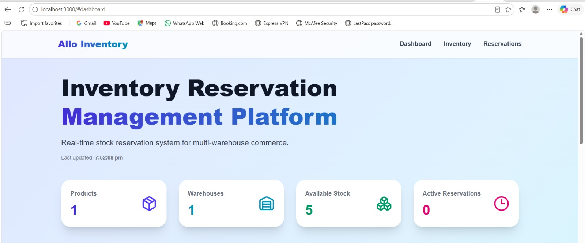
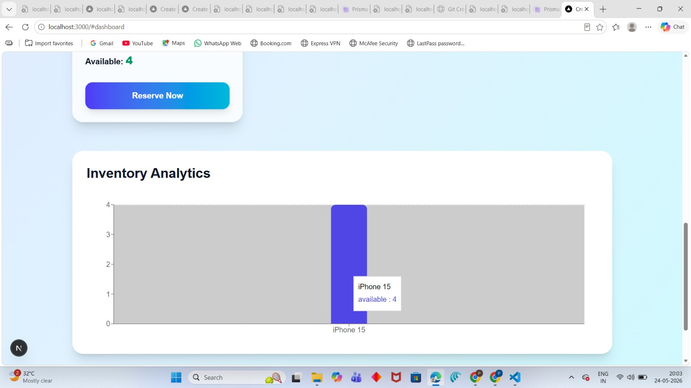
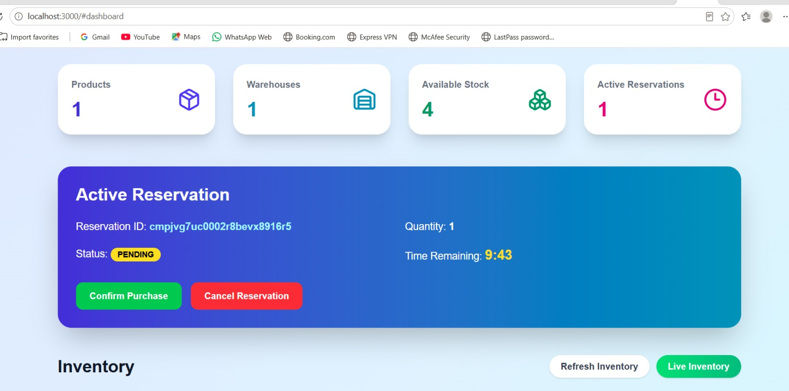
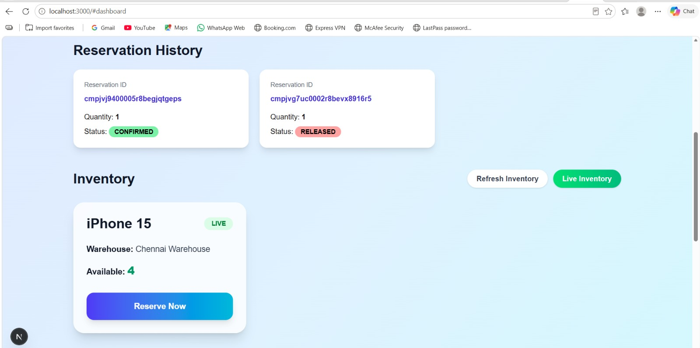
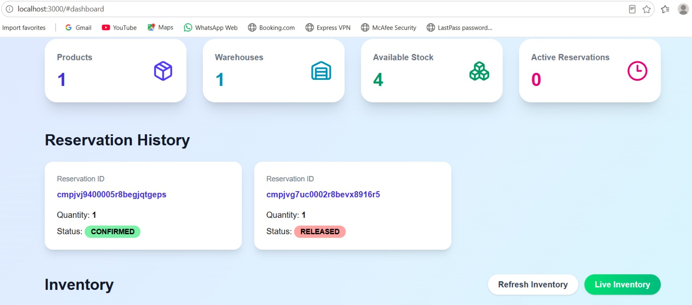
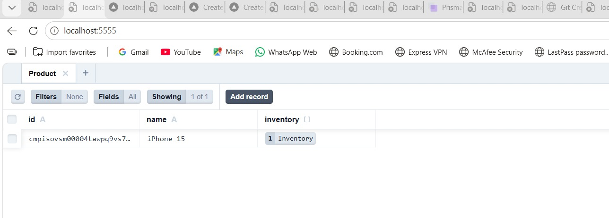
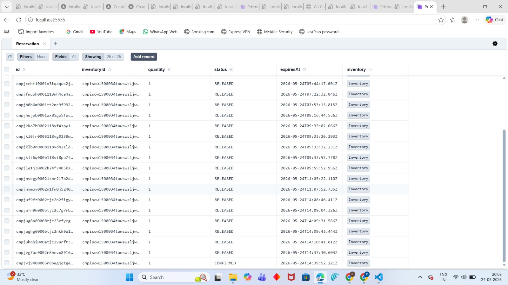
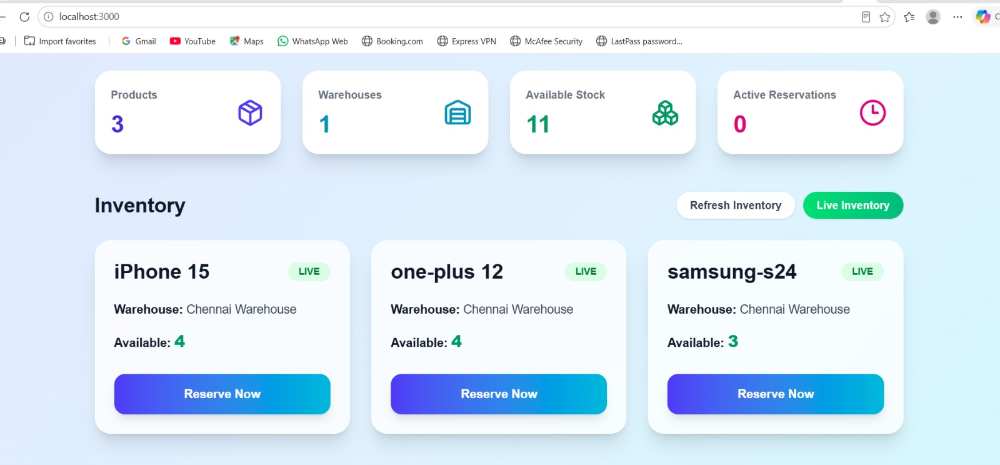
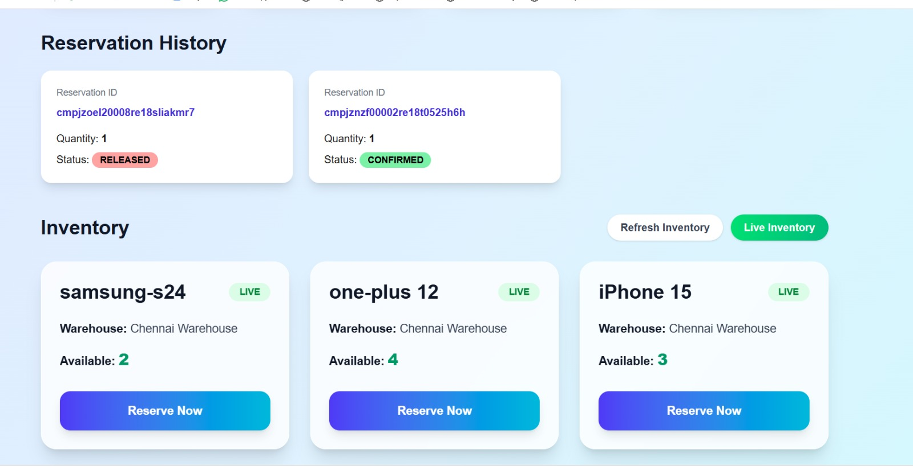
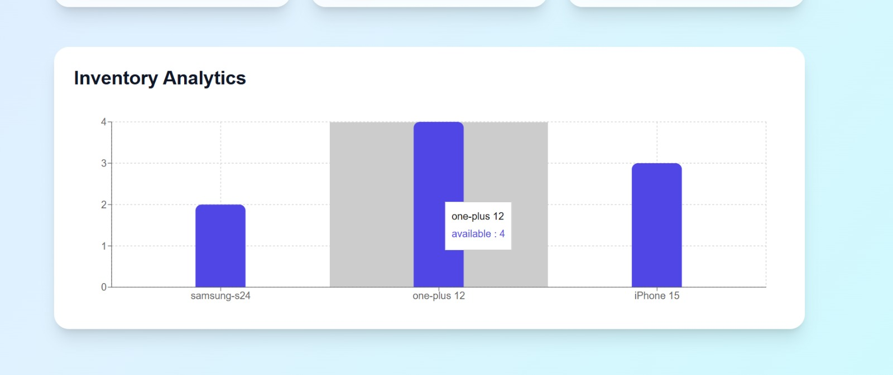

# Allo Inventory Reservation System

A real-time inventory reservation platform built using Next.js, Prisma, PostgreSQL (Supabase), Tailwind CSS, and TypeScript.

This project simulates a real-world inventory reservation workflow where users can reserve products, confirm purchases, cancel reservations, and track inventory updates in real time.

---

# Features

## Inventory Management
- Real-time inventory tracking
- Multi-warehouse inventory structure
- Dynamic stock availability updates
- Auto-refresh inventory dashboard

## Reservation System
- Reserve inventory items
- Confirm purchases
- Cancel reservations
- Reservation expiry timer
- Automatic stock restoration on cancellation

## Concurrency Protection
Implemented:
- Prisma database transactions
- Conditional atomic inventory updates

This prevents:
- race conditions
- overselling during simultaneous reservation requests

## Reservation History
- Tracks confirmed reservations
- Tracks cancelled/released reservations
- Displays reservation status history

## Analytics Dashboard
- Inventory analytics bar chart using Recharts
- Live inventory statistics
- Reservation metrics dashboard

## Validation & Error Handling
- Zod schema validation
- API error handling
- Out-of-stock protection
- Disabled UI states for invalid actions

---

# Tech Stack

## Frontend
- Next.js App Router
- TypeScript
- Tailwind CSS
- Recharts
- Lucide React Icons

## Backend
- Next.js API Routes
- Prisma ORM
- PostgreSQL (Supabase)

## Validation
- Zod

---

# Architecture Highlights

## Real-Time Reservation Flow
The system supports:
1. Product reservation
2. Reservation confirmation
3. Reservation cancellation
4. Reservation expiry handling
5. Inventory synchronization

## Concurrency Handling
Implemented transaction-safe reservation logic using Prisma transactions and conditional updates to mitigate race conditions and prevent overselling.

---
## Prisma Studio Database Management

Using Prisma Studio, inventory and reservation data can be managed directly from the database interface.

Supported operations:
- Add products
- Update stock quantities
- Manage inventory
- View reservations
- Delete reservations
- Track reservation lifecycle

# Setup Instructions

## Clone Repository

```bash
git clone https://github.com/pugazhendhis2022b-code/Allo-inventory-reservation-system.git

Install Dependencies
npm install

Configure Environment Variables

Create a .env file and configure:
DATABASE_URL=your_database_url

Run Development Server
npm run dev

Open:

http://localhost:3000

Project Highlights
Real-time inventory system
Reservation lifecycle management
Transaction-safe concurrency handling
Conditional inventory updates
Analytics dashboard
Modern responsive UI
Full-stack TypeScript implementation

screenshots
# Screenshots

## Dashboard



## Inventory


## Inventory Analytics



## Active Reservation



## Live Inventory Updates



## Reservation History



## Prisma Studio - Inventory


## Prisma Studio - Product



## Prisma Studio - Reservation



## Updated Inventory Dashboard



## Multiple Reservation History



## Multi Product Analytics



# Author

Pugazhendhi

GitHub:  
https://github.com/pugazhendhis2022b-code